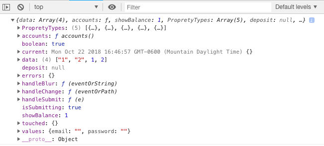
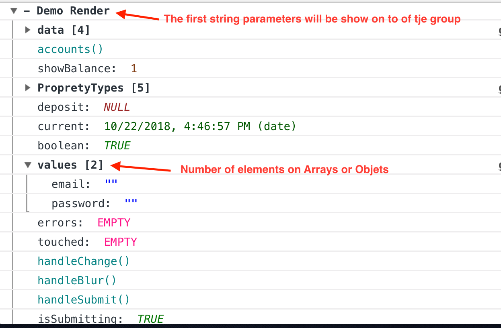

**console-logging**

Turn your plain console form this



To this


A wrapper around usual console.log() - This is a utility that I want to use along my frontend projects where I need to include logs for debugging and can easily turn them on/off by setting the logging level and make the console much easy to read.

## Usage

```
const logging = require("clean_logs");
const logger = logging.logger;
```

or ES6 import

```
import {LOGGING_LEVELS, logger } from 'clean_logs';
```

## Loggin Level

The use case of logger.setLevel() is in production environment, just switch on/off the logger and you have extra debug logs!
So remember to include logger.xyz() during app development.

```
logger.setLevel(logging.LOGGING_LEVELS.CRITICAL)
logger.setLevel("CRITICAL")  // Supports string levels: CLEAR, DEBUG, DEBUGDATA, WARNING, ERROR,

// or get level from environment variable
logger.setLevel(process.env.LOGGING_LEVEL)  // process.env.LOGGING_LEVEL = "CLEAR|DEBUG|DEBUGDATA|WARNING|ERROR"

logger.error("Transaction fail, transaction id 1")  // No output

logger.setLevel(logging.LOGGING_LEVELS.ERROR)
logger.error("Transaction fail, transaction id 1")  // Output 'Transaction fail, transaction id 1'

// multi-args is supported
logger.error("Hi", "I am", "an error")  // Output 'Hi I am an error'
```

## Log Formating

You have 5 log type clear, debug, debugdata, warning, error.
They all have the same great formating but each have some unique diferences.
This is how a console.log fo this.props on a React App looks

Exemple:

```
import React, { Component } from 'react';
import { LOGGING_LEVELS, logger } from 'clean_logs';

logger.setLevel(LOGGING_LEVELS.DEBUG);

class Demo extends Component {
  componentDidMount() {
    console.log(this.props);
    logger.debug('Demo Render', this.props);
  }
  render() {
    return <div>Test</div>;
  }
}

export default Demo;
```

## logger.debug

If you pass a string as one of the parameters clean_logs will use it as the title of the group, every type is displayed with a unique color and style,

- Arrays or Objects will be grouped and the leght of the objects added to the label
- Functions are DarkCyan <span style="color:DarkCyan"> someFuntion()</span>.
- Numbers are SaddleBrown and italic <span style="color:SaddleBrown ; font-style: italic"> 100</span>.
- string are blue <span style="color:blue  "> SomeString</span>
- undefined are Chocolate and italic <span style="color:Chocolate ; font-style: italic"> UNDEFINED</span>
- null are Brown and italic <span style="color:Brown ; font-style: italic"> NULL</span>
- dates are DarkGreen <span style="color:DarkGreen  "> 10/10/2018</span>
- moment object is ForestGreen and formated as lll <span style="color:ForestGreen  "> 10/10/2018</span>
- EMPTY are DeepPink <span style="color:DeepPink ; font-style: italic"> EMPTY</span>



## logger.debugdata

## License

MIT
